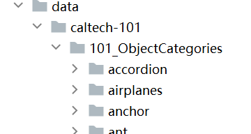
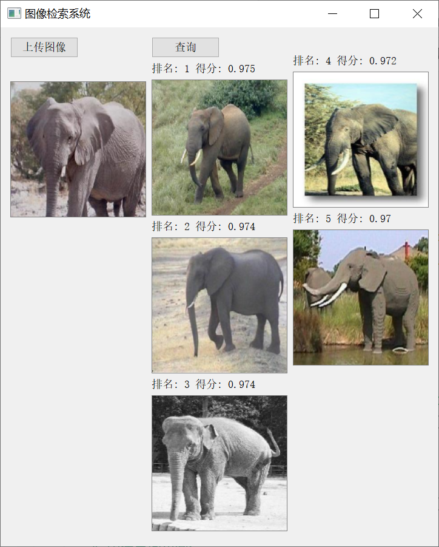

# 图像检索系统

## 环境
* 语言：`python3.8`
* 数据处理：`pytorch-1.13.1`
* 数据可视化：`PyQt5`

## caltech-101数据集链接
https://data.caltech.edu/records/mzrjq-6wc02 

## 数据集存放目录

- 数据根目录 data 
- 数据集目录 data/caltech-101/101_ObjectCategories 
- 最终划分训练集目录 data/train 
- 最终划分测试集目录 data/test

data/caltech-101/101_ObjectCategories目录结构如下图所示


> 提示：下载好caltech-101之后，请解压101_ObjectCategories至data/caltech-101中，data/train和data/test在训练时会自动切分生成
> 
> 如果不想下载caltech-101，也可以直接使用train和test，若想重新切分train和test请删除这两个文件夹

## 最终效果


## 代码结构
```
config.py：各参数配置文件
train.py：处理数据集，训练模型，进行图像特征提取
main.py：程序入口，直接运行即可，使用PyQt5进行可视化展示
```

## 使用
1. clone到本地
2. 准备环境：`python3.8`、`pytorch-1.13.1`
3. 运行main.py